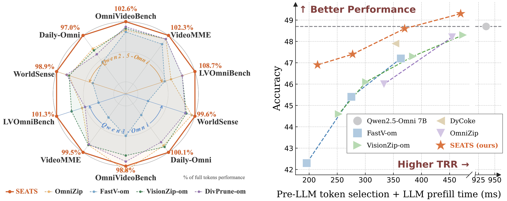
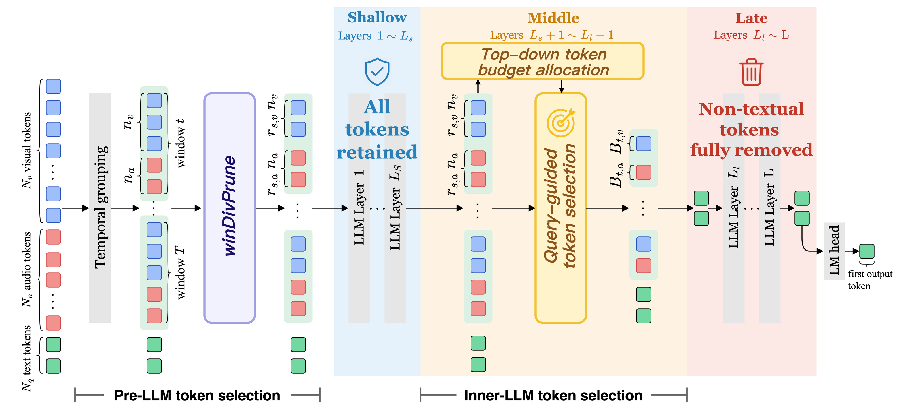

<div align="center">


<h1>Stage-adaptive Token Selection for Efficient Omni-modal LLMs</h1>

<div align="center">
  <a href="https://arxiv.org/abs/2605.20035"></a> &ensp;
  <a href="https://xxayt.github.io/SEATS/"></a> &ensp;
  <a href="https://github.com/xxayt/SEATS"></a> &ensp;
  <a href="https://huggingface.co/collections/xxayt/seats"></a> &ensp;
  <a href="https://github.com/xxayt/SEATS">
  </a> &ensp;
</div>

<div>
    <a href='https://xxayt.github.io/' target='_blank'>Zijie Xin</a><sup>1</sup>&emsp;
    <a href='https://yangjie-cv.github.io/' target='_blank'>Jie Yang</a><sup>2,📧</sup>&emsp;
    <a href='https://ruixiangzhao.github.io/' target='_blank'>Ruixiang Zhao</a><sup>1</sup>&emsp;
    <a href='' target='_blank'>Tianyi Wang</a><sup>2</sup>&emsp;
    <a href='https://scholar.google.com/citations?user=38dACd4AAAAJ&hl=zh-CN&oi=ao' target='_blank'>Fengyun Rao</a><sup>2</sup>&emsp;
    <a href='' target='_blank'>Jing Lyu</a><sup>2</sup>&emsp;
    <a href='http://lixirong.net/' target='_blank'>Xirong Li</a><sup>1,📧</sup>&emsp;
</div>
<div>
    📧 Corresponding authors
</div>
<div>
    <sup>1</sup> Renmin University of China&emsp; 
    <sup>2</sup> WeChat Vision, Tencent Inc.&emsp;
</div>


</div>

<hr>


## 📢 News
- **[2026/07/12]** 🚀 Released SEATS code for **Qwen3-Omni-30B**, with baselines and evaluation scripts.
- **[2026/06/07]** 🚀 Released SEATS code for **Qwen2.5-Omni-7B**, with LMMs-Eval adaptation and baselines.
- **[2026/05/19]** 📄 Paper released on [arXiv](https://arxiv.org/abs/2605.20035) and [project page](https://xxayt.github.io/SEATS/) is online.


## 👀 Overview
**SEATS** is a training-free, <u>s</u>tag<u>e</u>-<u>a</u>daptive <u>t</u>oken <u>s</u>election method for efficient omni-modal LLM inference. By analyzing layer-wise token dependency, it reveals that visual and audio dependencies follow a block-wise pattern and weaken with depth. SEATS removes spatiotemporal redundancy before the LLM, progressively prunes tokens inside the LLM, and fully removes non-textual tokens in late layers.


## ✨ Key Highlights
- 💡 **New Insight:** Reveals a block-wise dependence pattern in omni-modal LLMs, where reliance on visual and audio tokens weakens with layer depth.
- ⚡ **Strong Efficiency:** **9.3x FLOPs reduction** and **4.8x prefill speedup** at 10% token retention while preserving **96.3%** performance.
- 🎯 **Stage-adaptive Design:** Diversity-based pre-LLM selection + query-guided inner-LLM progressive pruning + late-layer full removal.
- 🔌 **Broad Compatibility:** Plug-and-play and training-free for direct application to Qwen2.5-Omni-7B and Qwen3-Omni-30B.


## 📅 TODO
- [x] Support Qwen2.5-Omni-7B
- [x] Release benchmark adaptation code for LMMs-Eval (WorldSense, Daily-Omni, OmniVideoBench, Video-MME, LVOmniBench)
- [x] Evaluation scripts and reproduction guide (adapted for LMMs-Eval)
- [x] Release more baseline implementations (FastV, VisionZip, Random)
- [x] Support Qwen3-Omni-30B
- [ ] Release more baseline implementations (DivPrune, DyCoke, and OmniZip)
- [ ] *future work*: Support more models (OmniVinci-7B)

## 🏗️ Method


SEATS is a three-stage method:
1. **Pre-LLM Token Selection:** Removes spatiotemporal redundancy within each temporal window via attention-weighted diversity selection.
2. **Inner-LLM Token Selection:** Progressively prunes tokens with a block-wise token retention ratio decay schedule and top-down budget allocation (inter-window then intra-window) guided by query relevance.
3. **Late-block Removal:** Removes all remaining non-textual tokens in late layers where cross-modal fusion is complete.

## 🔧 Dependencies and Installation
We used Anaconda to setup a deep learning workspace that supports PyTorch. Run the following script to install all the required packages.

```shell
# git clone this repository
git clone https://github.com/xxayt/SEATS.git
cd SEATS

# create a new anaconda env
conda create -n SEATS_env python=3.10 -y
conda activate SEATS_env

# install dependencies
bash scripts/base/setup.sh

# install the bundled lmms-eval in editable mode
cd lmms-eval
pip install -e .
cd ..

# (Recommended) install torch and flash-attn
# pip install torch==2.8.0 torchvision==0.23.0
pip install flash-attn --no-build-isolation
```


## 🚀 Evaluation

We adapt 5 omni-modal benchmarks into [LMMs-Eval](https://github.com/EvolvingLMMs-Lab/lmms-eval), so you can run them directly through this repository. Please first download the corresponding annotation data and videos from the links below.

| Benchmark | Data | Videos | Task name |
|---|---|---|---|
| Daily-Omni | [xxayt/Daily-Omni](https://huggingface.co/datasets/xxayt/Daily-Omni) | [liarliar/Daily-Omni](https://huggingface.co/datasets/liarliar/Daily-Omni) | [`dailyomni`](https://github.com/xxayt/SEATS/tree/main/lmms-eval/lmms_eval/tasks/dailyomni) |
| WorldSense | [lmms-lab/WorldSense](https://huggingface.co/datasets/lmms-lab/WorldSense) | [lmms-lab/WorldSense](https://huggingface.co/datasets/lmms-lab/WorldSense) | [`worldsense`](https://github.com/xxayt/SEATS/tree/main/lmms-eval/lmms_eval/tasks/worldsense) |
| OmniVideoBench | [NJU-LINK/OmniVideoBench](https://huggingface.co/datasets/NJU-LINK/OmniVideoBench) | [NJU-LINK/OmniVideoBench](https://huggingface.co/datasets/NJU-LINK/OmniVideoBench) | [`omnivideobench`](https://github.com/xxayt/SEATS/tree/main/lmms-eval/lmms_eval/tasks/omnivideobench) |
| Video-MME | [lmms-lab/Video-MME](https://huggingface.co/datasets/lmms-lab/Video-MME) | [lmms-lab/Video-MME](https://huggingface.co/datasets/lmms-lab/Video-MME) | [`videomme`](https://github.com/xxayt/SEATS/tree/main/lmms-eval/lmms_eval/tasks/videomme) |
| LVOmniBench | [xxayt/LVOmniBench](https://huggingface.co/datasets/xxayt/LVOmniBench) | [KD-TAO/LVOmniBench](https://huggingface.co/datasets/KD-TAO/LVOmniBench) | [`lvomnibench`](https://github.com/xxayt/SEATS/tree/main/lmms-eval/lmms_eval/tasks/lvomnibench) |


Once the data is ready, launch evaluation with the scripts under [`scripts/`](https://github.com/xxayt/SEATS/tree/main/scripts). Results are written to `output/`. We implement [`qwen2_5_omni_zip`](https://github.com/xxayt/SEATS/blob/main/lmms-eval/lmms_eval/models/simple/qwen2_5_omni_zip.py) and [`qwen3_omni_zip`](https://github.com/xxayt/SEATS/blob/main/lmms-eval/lmms_eval/models/simple/qwen3_omni_zip.py) as unified LMMs-Eval model wrappers that dispatch to SEATS and all baselines for omni-modal LLM token compression.

### Full tokens
```shell
bash scripts/eval_qwen2_5_omni_full_tokens.sh  # Qwen2.5-Omni-7B
bash scripts/eval_qwen3_omni_full_tokens.sh    # Qwen3-Omni-30B
```


### SEATS (*our method*)
To evaluate our SEATS method on the five benchmarks, use the following command:

```shell
bash scripts/eval_qwen2_5_omni_seats.sh  # Qwen2.5-Omni-7B
bash scripts/eval_qwen3_omni_seats.sh    # Qwen3-Omni-30B
```

You can customize the compression settings by editing:
- `scripts/eval_qwen2_5_omni_seats.sh` — `tasks_list` (which benchmarks to run) and `ratio_pairs` (per-modality token retention budgets, swept over multiple settings).
- `seats/config.yaml` — SEATS method hyperparameters (e.g., progressive drop layers, late-block layer, window size).

Qwen3-Omni-30B scripts follow the same pattern (`scripts/eval_qwen3_omni_seats.sh` + `seats/config_qwen3_30b.yaml`).


### Baselines
We also provide the following scripts to evaluate the baseline methods adapted for omni-modal LLMs:

| Method | Qwen2.5-Omni-7B | Qwen3-Omni-30B |
|---|---|---|
| Random | `scripts/eval_qwen2_5_omni_random.sh` | `scripts/eval_qwen3_omni_random.sh` |
| FastV | `scripts/eval_qwen2_5_omni_fastv.sh` | `scripts/eval_qwen3_omni_fastv.sh` |
| FastV-om | `scripts/eval_qwen2_5_omni_fastv_omni.sh` | `scripts/eval_qwen3_omni_fastv_omni.sh` |
| VisionZip | `scripts/eval_qwen2_5_omni_visionzip.sh` | `scripts/eval_qwen3_omni_visionzip.sh` |
| VisionZip-om | `scripts/eval_qwen2_5_omni_visionzip_omni.sh` | `scripts/eval_qwen3_omni_visionzip_omni.sh` |


### FLOPs Profiling

To compute the average LLM prefill TFLOPs per sample, add the following environment variable to your evaluation script:

```shell
export COST_ANALYSE=1
```


## 📁 Repo Structure

```
SEATS/
├── scripts/                          # Shell entry points (one per method) + shared base
│   ├── base/
│   │   ├── setup.sh                  # Python dependency installation
│   │   ├── eval_qwen2_5_omni_zip.sh  # Shared accelerate + lmms-eval launcher (Qwen2.5-Omni)
│   │   └── eval_qwen3_omni_zip.sh    # Shared accelerate + lmms-eval launcher (Qwen3-Omni)
│   ├── eval_qwen2_5_omni_seats.sh    # SEATS (our method, Qwen2.5-Omni)
│   ├── eval_qwen3_omni_seats.sh      # SEATS (our method, Qwen3-Omni)
│   └── ...
├── seats/                            # SEATS three-stage implementation
│   ├── pre_llm_units.py              # Stage I: winDivPrune
│   ├── inner_llm_units.py            # Stage II: inner-LLM stage-adaptive selection
│   ├── ratio_decay_scheduler.py      # block-wise TRR decay schedule
│   ├── modeling_qwen2_5_omni_seats.py # patched Thinker / TextModel forwards (Qwen2.5-Omni)
│   ├── modeling_qwen3_omni_seats.py  # patched Thinker / TextModel forwards (Qwen3-Omni)
│   └── config.yaml                   # SEATS hyperparameters
├── baselines/                        # Per-method patches; one subfolder per baseline
│   ├── utils.py                      # apply_zip_method_patch() dispatcher
│   ├── cost_metrics.py               # LLM prefill FLOPs estimation (theoretical)
│   ├── full_tokens/                  # No compression (config only)
│   ├── visionzip_omni/               # VisionZip adapted for omni-modal
│   └── ...
├── models/
│   ├── qwen2_5_omni/                 # Vendored Qwen2.5-Omni model code
│   └── qwen3_omni_moe/              # Vendored Qwen3-Omni model code
└── lmms-eval/                        # Vendored LMMs-Eval (registers `qwen2_5_omni_zip`)
```


## 🤝 Acknowledgement
This implementation relies on resources from [Qwen2.5-Omni](https://github.com/QwenLM/Qwen2.5-Omni), [Qwen3-Omni](https://github.com/QwenLM/Qwen3-Omni), [LMMs-Eval](https://github.com/EvolvingLMMs-Lab/lmms-eval), [OmniZip](https://github.com/KD-TAO/OmniZip), [VisionZip](https://github.com/JIA-Lab-research/VisionZip), and [DivPrune](https://github.com/vbdi/divprune). We thank the original authors for their excellent contributions and for making their work publicly available.


## ✏️ Citation
If you find this work useful, please consider citing:

```bibtex
@article{xin2026seats,
  title={Stage-adaptive Token Selection for Efficient Omni-modal LLMs},
  author={Xin, Zijie and Yang, Jie and Zhao, Ruixiang and Wang, Tianyi and Rao, Fengyun and Lyu, Jing and Li, Xirong},
  journal={arXiv preprint arXiv:2605.20035},
  year={2026}
}
```


## 📜 License
This project is licensed under the [MIT License](./LICENSE). For commercial licensing or any use beyond research, please contact the authors.

#### 📬 Contact for Issues
For any questions about this project (e.g., corrupted files or loading errors), please reach out at: [xinzijie@ruc.edu.cn](mailto:xinzijie@ruc.edu.cn)